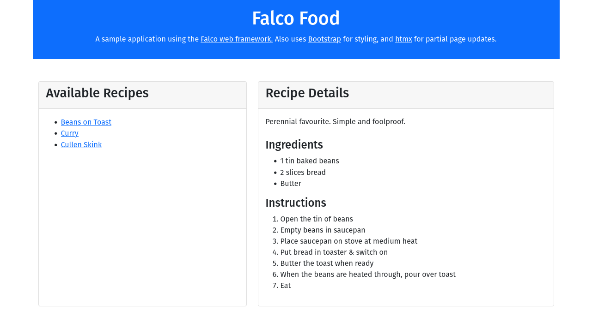

# FalcoFood - an exploratory example

This is an in-progress sample application built with the [Falco](https://www.falcoframework.com) F# web framework.  I'm building it to explore Falco, and web apps in F# more generally.  It uses  [Bootstrap 5](https://getbootstrap.com/) for styling and [htmx](https://htmx.org/) for in-page updates. More on the approach [below](#approach).

## Setup

1. Download & install [dotnet](https://dotnet.microsoft.com/en-us/download).  The project was built and tested with v7 though should work with v6.
2. Clone this repo:

          $ cd /my/projects/dir
          $ git clone https://github.com/sfinnie/FalcoFood
 
3. Build the solution (this wil automatically download required packages):

          $ cd FalcoFood
          $ dotnet build

## Running

* Run server in hot reload mode:

        $ dotnet watch --project src/FalcoFood

* Run server in "prod" mode:

      $ dotnet run  --project src/FalcoFood

In either case, open your browser at [http://localhost:5000/](http://localhost:5000/) once the app has started.

## Approach

The goal was to produce a "midi" sized example.  It's not a real app, but aims to go a step beyond the minimal (though extremely helpful) examples in the [Falco repo](https://github.com/pimbrouwers/Falco/tree/master/samples/).  In particular, it explores using [Falco Markup](https://www.falcoframework.com/docs/markup.html) to build a representative page styled with [Bootstrap](https://getbootstrap.com/) and using [htmx](https://htmx.org/) for in-page updates.  Note it doesn't use the [Falco.Htmx](https://github.com/dpraimeyuu/Falco.Htmx) module.  That's currently experimental and doesn't exist as a NuGet package, so installation is a bit more complex.  Besides, this app uses a very small part of htmx, so it's easy to code directly.  Everything is currently in one source file - see [Program.fs](src/FalcoFood/Program.fs).

The app lists a few recipes.  Selecting a recipe on the left lists the details on the right.  Recipes can either be "inline" - ingredients and instructions shown directly - or links to websites.  See the screenshot for an example.

